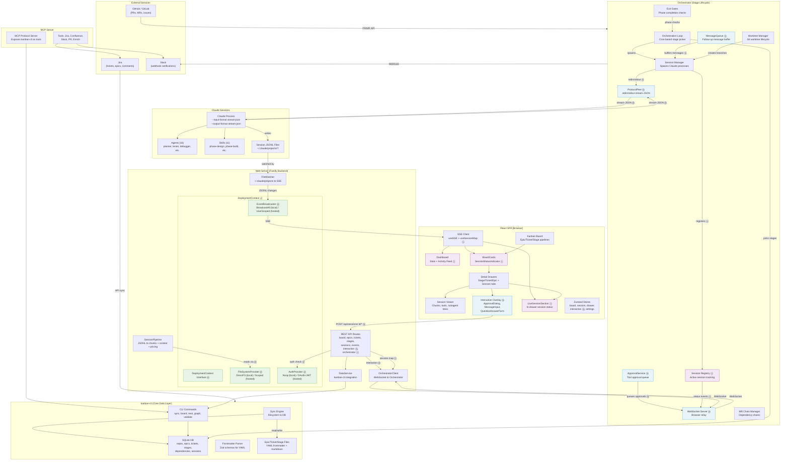

# Handoff Document — Week of 2026-03-02

## Quick Start

### 1. Clone and Build

```bash
git clone git@github.com:jakekausler/claude-code-workflow.git
cd claude-code-workflow

# Install and build each tool
cd tools/kanban-cli && npm install && npm run build && cd ../..
cd tools/web-server && npm install && npm run build && cd ../..
cd tools/orchestrator && npm install && npm run build && cd ../..
cd tools/mcp-server && npm install && npm run build && cd ../..
```

### 2. Install Agents and Skills

**IMPORTANT**: Before running the orchestrator or expecting Claude sessions to follow the workflow pipeline, you MUST have the project's agents and skills installed in your global `~/.claude/` directory. See issue #38 for the long-term automated solution.

```bash
# Copy agents (16 agent configs)
mkdir -p ~/.claude/agents
cp agents/*.md ~/.claude/agents/

# Copy skills (11 skill directories)
mkdir -p ~/.claude/skills
cp -r skills/* ~/.claude/skills/
```

### 3. Seed a Test Repo

```bash
# Creates /tmp/kanban-test-repo with 3 epics, 6 tickets, 30 stages in diverse states
bash tools/kanban-cli/scripts/seed-test-repo.sh

# Sync the test repo into SQLite
cd tools/kanban-cli
npx tsx src/cli/index.ts sync --repo /tmp/kanban-test-repo --pretty

# Verify it looks right
npx tsx src/cli/index.ts board --repo /tmp/kanban-test-repo --pretty
```

### 4. Run Dev Servers

```bash
# Web server (Fastify + Vite dev mode) — accessible at http://192.168.2.148:3100
cd tools/web-server && npm run dev

# Orchestrator (in a separate terminal)
cd tools/orchestrator && npm run dev

# MCP server (if needed for Claude Code integration)
cd tools/mcp-server && npm run dev
```

### 5. Run Tests

```bash
# Per-tool (lint + test)
cd tools/kanban-cli && npm run verify
cd tools/web-server && npm run verify
cd tools/orchestrator && npm run verify
cd tools/mcp-server && npm run verify
```

---

## 1. Branch Overview

The `kanban` branch is the primary integration branch. It currently contains:
- **Stages 0–9**: All complete and merged (CLI, kanban engine, Jira, orchestrator infra, MCP server, Slack, multi-repo, web UI)
- **Stage 10A**: Orchestrator communication foundation (merged)
- **Stage 10E**: Drawer session integration — session tabs in detail drawers, multi-session history (merged)

The `worktree-stage-10d` branch contains ALL of 10b + 10c + 10d stacked on top of each other. It is up to date with current `kanban` but **nothing on this branch has been tested**. See the testing plan at `docs/plans/2026-02-27-stage-10bcd-testing-plan.md`.

---

## 2. Stage 9 — Session Display & Live Updates

### Status: Done — Functional but Sketchy

The web UI is working and displays the kanban board, detail drawers, and session viewer. The most recent work has been on **getting new messages to show up consistently** via SSE (Server-Sent Events) with incremental parsing.

### Known Issues
- **SSE lag**: Live updates on the session page work but have a noticeable lag behind the CLI output. This may be expected given the debounce window (300ms) plus incremental parse time, but worth investigating if it feels excessive.
- **Session display inconsistencies**: The session viewer (chunk rendering, tool display, subagent trees) occasionally has rendering issues.

### Testing Session Display

You can test the session viewer at a full-screen URL like:
```
http://192.168.2.148:3100/sessions/-storage-programs-claude-code-workflow/ce38eeb0-5907-4205-9c4a-bc00936f0fb1
```
This is NOT where stage sessions normally appear (they'll be embedded in drawers via 10E), but it's useful for full-screen testing of the session rendering pipeline.

### Gold Standard: claude-devtools

**When things don't work in the session viewer, treat the [`claude-devtools`](https://github.com/anthropics/claude-devtools) repository as the source of truth.** Our session parsing pipeline (JSONL parsing, chunk building, tool rendering, subagent resolution, context tracking) was heavily based on their implementation. If something is broken:

1. Find the equivalent code in claude-devtools
2. Compare their approach with ours
3. Follow their method exactly before trying to enhance
4. Only diverge after the base behavior matches

Key files to compare:
- Session parsing: our `session-parser.ts` / `session-pipeline.ts` vs their equivalents
- Chunk building: our `chunk-builder.ts` vs theirs
- Tool rendering: our `components/tools/` vs theirs
- Context tracking: our `context-tracker.ts` vs theirs

---

## 3. Stage 10 — Session Monitor Integration (Written, Not Tested)

### Branch Structure

Stage 10 was developed in parallel worktree branches. Each builds on the previous:

```
kanban                         (primary integration branch — stages 0-9, 10A, 10E)
  └─ worktree-stage-10b-bidirectional-interaction
       └─ worktree-stage-10c-live-session-status
            └─ worktree-stage-10d (deployment abstraction — has ALL of 10b+10c+10d)
```

All three branches are pushed to GitHub. **Use `worktree-stage-10d` for testing** — it contains everything.

**What each substage implemented:**
- **10b** — ProtocolPeer (stdin/stdout stream-JSON), ApprovalService, MessageQueue, REST interaction endpoints, browser interaction overlay (ApprovalDialog, MessageInput, QuestionAnswerForm)
- **10c** — Session-to-stage mapping via orchestrator WS events, SessionStatusIndicator component, BoardCard session status, LiveSessionSection in stage drawer, Dashboard activity feed enrichment, useSessionMap hook
- **10d** — DeploymentContext interface, FileSystemProvider/AuthProvider/EventBroadcaster abstractions, LocalDeploymentContext (local mode implementations), HOSTED-DESIGN.md for future multi-user

### Critical Blocker: Orchestrator → Session Lifecycle

**None of 10b/10c/10d have been tested** because they depend on sessions actually running through the orchestrator's phase lifecycle. The biggest thing to figure out before testing:

> **The orchestrator needs to correctly move sessions between phases (Design → Build → Refinement → Finalize).** Only when that's working will sessions show up on the frontend with the expected state transitions.

However, **unit tests and integration tests with mocked orchestrators can be run now**. See the comprehensive testing plan at `docs/plans/2026-02-27-stage-10bcd-testing-plan.md`.

### Gold Standard: vibe-kanban

**When things aren't working with Claude session interaction (10b/10c), treat the [`vibe-kanban`](https://github.com/vibe-kanban/vibe-kanban) repository as the source of truth** for how to interact with Claude sessions. Their implementation is the reference for:
- WebSocket relay to Claude's stdin/stdout
- Stream-JSON protocol handling
- Session state management
- Tool approval and question answering from the browser

If the interaction flow isn't working, compare our approach with theirs and follow their practices.

---

## 4. Orchestrator Testing

### Status: Minimally Tested

The orchestrator (`tools/orchestrator/`) has only been tested with small, isolated runs. It has NOT been verified running a full pipeline end-to-end (picking up a stage, running Design → Build → Refinement → Finalize, creating MRs, handling dependencies).

### How to Test with Mocked MCPs

See GitHub issue #4 for the full mocked test plan. The basic setup:

```bash
# 1. Seed a test repo
bash tools/kanban-cli/scripts/seed-test-repo.sh
# Creates /tmp/kanban-test-repo with 3 epics, 6 tickets, 30 stages

# 2. Sync the test repo
cd tools/kanban-cli
npx tsx src/cli/index.ts sync --repo /tmp/kanban-test-repo --pretty

# 3. Run the orchestrator against it (with mocked external services)
cd tools/orchestrator
npm run dev
```

### Key Test Scenarios (Issue #4)
- [ ] Stages move from phase to phase correctly
- [ ] Users can respond when Claude stops, from the browser
- [ ] Logs indicate external services would have been called correctly
- [ ] Session log is viewable and live-updated in the phase drawer
- [ ] Stages advance when dependencies are unlocked

---

## 5. Project Structure

### Monorepo Layout

```
claude-code-workflow/
├── tools/
│   ├── kanban-cli/          # Core CLI — SQLite DB, frontmatter parsing, board/graph/sync
│   │   ├── src/
│   │   │   ├── cli/         # Commander.js command definitions
│   │   │   ├── db/          # SQLite schema, repositories, migrations
│   │   │   ├── engine/      # Kanban logic (board columns, next stage selection)
│   │   │   ├── parser/      # YAML frontmatter schemas and parsing (Zod)
│   │   │   ├── sync/        # Filesystem → DB sync engine
│   │   │   ├── jira/        # Jira API integration
│   │   │   ├── resolvers/   # Data resolvers (graph, dependencies)
│   │   │   └── validators/  # Frontmatter validation
│   │   ├── scripts/
│   │   │   ├── seed-test-repo.sh      # Creates test repo with diverse data
│   │   │   ├── seed-old-format-repo.sh # Legacy format for migration testing
│   │   │   └── jira/                   # Jira reader/writer scripts
│   │   └── tests/           # 888+ Vitest tests
│   │
│   ├── web-server/          # Full-stack web UI (Fastify + React 19)
│   │   ├── src/
│   │   │   ├── server/      # Fastify backend
│   │   │   │   ├── routes/  # REST API (board, epics, tickets, stages, sessions, events)
│   │   │   │   └── services/# Business logic
│   │   │   │       ├── session-pipeline.ts   # JSONL → chunks + context + pricing
│   │   │   │       ├── file-watcher.ts       # Watches ~/.claude/projects for changes
│   │   │   │       ├── orchestrator-client.ts # WebSocket relay to orchestrator
│   │   │   │       └── data-service.ts       # Kanban CLI integration
│   │   │   ├── client/      # React SPA
│   │   │   │   ├── pages/   # Dashboard, Board, SessionDetail, EpicDetail, etc.
│   │   │   │   ├── components/
│   │   │   │   │   ├── board/   # Kanban columns, cards, pipelines
│   │   │   │   │   ├── chat/    # Session viewer (chunks, context panel)
│   │   │   │   │   ├── detail/  # Drawers for stages/tickets/epics
│   │   │   │   │   └── tools/   # Tool renderers (Bash, Read, Edit, Write, etc.)
│   │   │   │   ├── store/   # Zustand stores (board, session, drawer, settings)
│   │   │   │   └── api/     # React Query hooks + SSE client
│   │   │   └── types/
│   │   └── tests/           # 46+ Vitest tests
│   │
│   ├── orchestrator/        # Cron-based stage lifecycle automation
│   │   ├── src/
│   │   │   ├── loop.ts          # Main orchestration loop
│   │   │   ├── session.ts       # Claude session lifecycle
│   │   │   ├── protocol-peer.ts # stdin/stdout stream-JSON protocol
│   │   │   ├── ws-server.ts     # WebSocket server for browser relay
│   │   │   ├── worktree.ts      # Git worktree management
│   │   │   ├── mr-chain-manager.ts # MR dependency chains
│   │   │   ├── exit-gates.ts    # Phase completion gates
│   │   │   └── resolvers.ts     # Stage/phase resolution
│   │   └── tests/
│   │
│   └── mcp-server/          # MCP server exposing kanban-cli as Claude tools
│       ├── src/
│       │   ├── server.ts    # MCP server implementation
│       │   └── tools/       # Jira, Confluence, Slack, PR, enrichment tools
│       └── tests/
│
├── docs/
│   ├── plans/               # Design docs for every stage
│   │   ├── 2026-02-27-post-stage-10-issues-design.md  # Future issues overview
│   │   ├── 2026-02-25-stage-9-10-web-ui-design.md     # Main stage 9-10 design (209KB)
│   │   └── stage-9-10-substages/                       # Per-substage specs
│   └── issues/              # Local drafts of all GitHub issues (034 files)
│
├── examples/
│   └── epics/               # Example epic/ticket/stage structure
│
├── CLAUDE.md                # Project development guidelines
├── TODO.md                  # Outstanding work items
└── IMPLEMENTATION_PLAN.md   # Stage 8-14 breakdown
```

### Architecture Diagram (Including 10B/10C/10D)



**Legend**: ⓑ = Stage 10B (bidirectional interaction), ⓒ = Stage 10C (live session status), ⓓ = Stage 10D (deployment abstraction)

### Architecture Notes

#### Data Flow: Two Paths

The system has two distinct data paths:

1. **Display Path** (read-only, SSE-driven): Claude writes to JSONL files → FileWatcher detects changes → SessionPipeline parses JSONL into chunks/context/pricing → SSE broadcasts to browser → React re-renders session viewer. This is the Stage 9 path and works now (with some lag).

2. **Interaction Path** (bidirectional, WebSocket-driven): Browser sends user input → REST endpoint → OrchestratorClient → WebSocket → Orchestrator WSServer → ApprovalService/MessageQueue → ProtocolPeer → Claude stdin (stream-JSON). Claude responds via stdout → ProtocolPeer → session events. This is the Stage 10B path and is written but untested.

#### Orchestrator Lifecycle

The orchestrator runs a cron loop (`loop.ts`) that:
1. Queries kanban-cli for the next workable stage (`next` command)
2. Creates a git worktree for the stage (`worktree.ts`)
3. Spawns a Claude process with `--input-format=stream-json --output-format=stream-json` (`session.ts`)
4. Communicates via ProtocolPeer over stdin/stdout (`protocol-peer.ts`) [10B]
5. Registers the session in SessionRegistry and broadcasts status via WS (`session-registry.ts`) [10C]
6. Checks exit gates to determine when a phase is complete (`exit-gates.ts`)
7. Transitions the stage to the next phase (Design → Build → Refinement → Finalize)
8. Creates MRs and handles MR comment polling at the end (`mr-chain-manager.ts`, `mr-comment-poller.ts`)

#### Deployment Abstraction (10D)

All I/O is abstracted behind interfaces so the same codebase works in local and hosted modes:

| Interface | Local Implementation | Hosted Implementation (future) |
|-----------|---------------------|-------------------------------|
| `FileSystemProvider` | `DirectFileSystemProvider` — pass-through to Node fs | `ScopedFileSystemProvider` — restricts to user's home dir |
| `AuthProvider` | `NoopAuthProvider` — allows everything | GitHub OAuth + JWT with refresh token rotation |
| `EventBroadcaster` | `BroadcastAllSSE` — sends to all clients | `UserScopedSSE` — per-user channels |
| `DeploymentContext` | `LocalDeploymentContext` — wires the above | `HostedDeploymentContext` — PostgreSQL + Docker |

#### Real-Time Communication Stack

| Channel | Direction | Purpose |
|---------|-----------|---------|
| **SSE** (Server-Sent Events) | Server → Browser | Session JSONL updates, board changes, session status [10C] |
| **WebSocket** (Orchestrator ↔ Web Server) | Bidirectional | Session lifecycle events, approval requests, user messages [10B] |
| **stream-JSON** (stdin/stdout) | Orchestrator ↔ Claude | Tool approvals, user messages, control requests [10B] |
| **REST** | Browser → Server | CRUD operations, interaction endpoints [10B] |

#### State Management

| Store | Scope | What It Holds |
|-------|-------|--------------|
| `board-store` | Global | Board data, filters, selected pipeline |
| `session-store` | Global | Current session data, chunks, context |
| `drawer-store` | Global | Open drawer state, selected entity |
| `drawer-session-store` | Per-drawer | Session within a drawer (multi-session history) |
| `interaction-store` | Global | Pending approvals and questions [10B] |
| `settings-store` | Global | User preferences (theme, display options) |
| `sidebar-store` | Global | Sidebar open/collapsed state |

### Key Technologies
- **Backend**: Node.js, TypeScript, Fastify, WebSocket, Commander.js
- **Frontend**: React 19, Vite, TailwindCSS, Zustand, TanStack React Query, React Router
- **Database**: better-sqlite3 (local), PostgreSQL planned (hosted)
- **Testing**: Vitest (888+ tests in kanban-cli, 46+ in web-server)
- **Real-time**: SSE (server → client), WebSocket (orchestrator ↔ web-server), stream-JSON (orchestrator ↔ Claude)
- **Integrations**: Jira, Confluence, Slack, GitHub/GitLab APIs

### npm Scripts (per tool)

Each tool has: `dev`, `build`, `test`, `lint`, `verify` (lint + test)

There is no root package.json — run commands within each tool directory.

---

## 6. Future Milestones & Issues

34 GitHub issues have been created and organized into milestones. See the full overview at `docs/plans/2026-02-27-post-stage-10-issues-design.md`.

### Phase 10 — Testing (Issues #4–#10)
Validate stages 9-10 with mocked and real-service integration tests.
- #4: Mocked orchestrator integration test plan (comprehensive checklist)
- #5–#6: Jira integration test setup + plan
- #7–#8: Git/MR integration test setup + plan
- #9–#10: Slack integration test setup + plan

### Phase 11 — Infrastructure + Core Features (Issues #11–#21, #38)
- #11: GitHub Actions CI pipeline
- #12: New Relic monitoring (full stack)
- #13: Credits/attribution (claude-devtools, vibe-kanban)
- #14: User setup and usage guide
- #15: Jira ticket auto-pull filters (multi-dimensional + JQL)
- #16: Jira import UI flow
- #17: UI-based epic and ticket creation
- #18: Ticket-to-stage conversion session (button → Claude session in drawer)
- #19: Stage view markdown content + frontmatter metadata
- #20: Move checklists to YAML frontmatter
- #21: Phase sibling content rendering (sister files under each phase)
- #38: Install script for agents/skills to global ~/.claude

### Phase 12 — Hosted Deployment (Issues #22–#26)
- #22: GitHub OAuth + JWT authentication
- #23: PostgreSQL schema + data layer
- #24: ScopedFileSystemProvider (path traversal protection)
- #25: UserScopedSSE (per-user event channels)
- #26: Docker deployment configuration

### Phase 13 — Multi-User & RBAC (Issues #27–#28)
- #27: Role-based access control (per-repo roles + global admin)
- #28: Team management (internal team CRUD)

### Phase 14 — UI Enhancements + GitHub/GitLab Import (Issues #29–#36)
- #29: Improved dependency graph (interactive, drawer integration)
- #30: MR/branch hierarchy DAG view (multi-parent support)
- #31: Tool renderer audit + enrichment (comparison with claude-devtools, MCP tool registry)
- #32: Long-session rendering performance (virtualization)
- #33: Mobile responsiveness improvements
- #34: Settings page (service connections + user preferences)
- #35: Global search and filter
- #36: GitHub/GitLab issue import (on-demand + periodic sync)

### Phase 15 — Permissions Gating (Issue #37)
- #37: RBAC permissions on all create/import/convert flows

---

## 7. Priority for Next Week

Suggested order of focus:

1. **Get the orchestrator running end-to-end** with the seed script. This unblocks everything else. Start with mocked external services.
2. **Stabilize Stage 9 session display** — compare with claude-devtools when things break.
3. **Merge and test 10b** (bidirectional interaction) — resolve conflicts with latest Stage 9, then test with a running orchestrator session.
4. **Merge and test 10c** (live status) — builds on 10b.
5. **Merge and test 10d** (deployment abstraction) — builds on 10c.
6. If time allows, start on Phase 10 testing issues (#4–#10).

---

## 8. Reference Repositories

| Repository | Use For | When |
|-----------|---------|------|
| **claude-devtools** | Session display, JSONL parsing, tool rendering, chunk building | Stage 9 bugs — copy their approach first |
| **vibe-kanban** | Claude session interaction, WebSocket relay, stream-JSON protocol | Stage 10b/10c bugs — follow their practices |

---

## 9. Key Files to Know

| File | What It Does |
|------|-------------|
| `tools/web-server/src/server/app.ts` | Fastify setup, route registration, SSE/file-watcher integration |
| `tools/web-server/src/server/services/file-watcher.ts` | Watches ~/.claude/projects for JSONL changes, triggers SSE |
| `tools/web-server/src/server/services/session-pipeline.ts` | JSONL → chunks + context + pricing (incremental parsing) |
| `tools/orchestrator/src/loop.ts` | Main orchestration loop — picks stages, spawns sessions |
| `tools/orchestrator/src/session.ts` | Claude session lifecycle management |
| `tools/orchestrator/src/protocol-peer.ts` | stdin/stdout stream-JSON protocol for Claude communication |
| `tools/kanban-cli/src/parser/frontmatter-schemas.ts` | Zod schemas for epic/ticket/stage YAML frontmatter |
| `tools/kanban-cli/src/db/schema.ts` | SQLite database schema |
| `tools/kanban-cli/scripts/seed-test-repo.sh` | Creates test data for integration testing |
| `CLAUDE.md` | Development guidelines (subagent rules, code quality, commit standards) |
| `docs/plans/2026-02-25-stage-9-10-web-ui-design.md` | Comprehensive Stage 9-10 design document (209KB) |

---

## 10. Environment Notes

- **Server**: Accessible at `http://192.168.2.148:3100`
- **Frontend log file**: `/tmp/claude-code-workflow.frontend.log` (browser console forwarded via POST /api/log, cleared on page refresh)
- **Claude model**: Opus 4.6 (configured in ~/.claude/settings.json)
- **Git worktrees**: Located in `.claude/worktrees/` — three active for 10b/10c/10d
- **Database**: SQLite at standard kanban-cli location
- **Session files**: Watched at `~/.claude/projects/` for JSONL changes
