# Kanban Workflow System — End State Vision

**Date**: 2026-02-16
**Purpose**: Complete documentation of the fully realized workflow system. Describes the final state as if all delivery stages are complete. Used as a north-star reference for what this system will eventually be.

---

## Table of Contents

1. [System Overview](#1-system-overview)
2. [Work Item Hierarchy](#2-work-item-hierarchy)
3. [Work Item Creation](#3-work-item-creation)
4. [The Kanban Board](#4-the-kanban-board)
5. [The Orchestration Loop](#5-the-orchestration-loop)
6. [Phase Workflows](#6-phase-workflows)
7. [Environment Variables](#7-environment-variables)
8. [User Intervention Points](#8-user-intervention-points)
9. [External Integrations](#9-external-integrations)
10. [Infrastructure](#10-infrastructure)
11. [Master Flow Diagrams](#11-master-flow-diagrams)

---

## 1. System Overview

The Kanban Workflow System is a file-based, AI-agent-driven development orchestration platform. It coordinates Claude Code sessions to work on multiple development tasks in parallel across multiple repositories, tracking all work on a kanban board with dependency management, Jira integration, and a web UI with real-time session monitoring.

### Core Principles

- **Files are the source of truth.** Markdown files with YAML frontmatter define all work items. A SQLite database caches this data for fast queries. A web UI visualizes it. But the files are canonical.
- **Stages are where work happens.** Epics and tickets are organizational containers. Stages contain the four-phase workflow (Design → Build → Refinement → Finalize).
- **Per-stage worktree isolation.** Every active stage gets its own git worktree and branch. Parallel work never causes merge conflicts at the filesystem level.
- **The orchestration loop dispatches, Claude sessions execute.** An external TypeScript scheduler picks up ready stages and spawns fresh Claude sessions in worktrees. Each session does one unit of work and exits. The loop respawns as needed.
- **Human intervention is explicit and trackable.** When a stage needs a human decision (design choice, refinement approval, code review), it moves to an "Awaiting" column. The loop skips it and works on other stages. The web UI shows what's waiting for you.

### Architecture Layers

```
┌──────────────────────────────────────────────────────────┐
│                      WEB UI (React)                      │
│  Kanban board, session monitor, prompt answering         │
├──────────────────────────────────────────────────────────┤
│                 ORCHESTRATION LOOP (TypeScript)           │
│  External scheduler, priority queue, worker spawning     │
├──────────────────────────────────────────────────────────┤
│                    CLI TOOL (kanban-cli)                  │
│  board, graph, next, summary, validate, sync, migrate    │
├──────────────────────────────────────────────────────────┤
│                 SQLITE CACHE (global DB)                  │
│  ~/.config/kanban-workflow/kanban.db                      │
├──────────────────────────────────────────────────────────┤
│             MARKDOWN FILES (source of truth)              │
│  epics/ directory in each registered repo                │
├──────────────────────────────────────────────────────────┤
│               CLAUDE CODE SESSIONS (workers)             │
│  Skills: ticket-stage-workflow, phase-*, review-cycle    │
├──────────────────────────────────────────────────────────┤
│              SESSION MONITOR (WebSocket)                  │
│  Real-time event capture, session status, token tracking │
├──────────────────────────────────────────────────────────┤
│           EXTERNAL SERVICES                              │
│  Jira (bidirectional), GitHub/GitLab (MR/PR), Slack      │
└──────────────────────────────────────────────────────────┘
```

---

## 2. Work Item Hierarchy


| Level | ID Pattern | Example | Purpose |
|-------|-----------|---------|---------|
| **Epic** | `EPIC-XXX` | `EPIC-001` | A theme or initiative grouping related tickets. Status computed from children. Linked to Jira epics (read-only, no auto-transitions). |
| **Ticket** | `TICKET-XXX-YYY` | `TICKET-001-002` | A feature or capability. Contains stages. Status computed from children. Syncs bidirectionally with Jira tickets. Can exist without stages (needs conversion). |
| **Stage** | `STAGE-XXX-YYY-ZZZ` | `STAGE-001-002-003` | A concrete unit of work. Contains four phases. This is where code gets written, tested, and reviewed. Each stage gets its own git worktree and branch. |
| **Phase** | N/A | Design, Build, Refinement, Finalize | The workflow within a stage. Sequential, mandatory. |

IDs embed the hierarchy — `STAGE-001-002-003` belongs to `TICKET-001-002` which belongs to `EPIC-001`. Any ID is globally unique and self-describing.

### Dependencies

Dependencies are declared in YAML frontmatter via `depends_on` at every level:


**Resolution rules**:
- A dependency on a **stage** is resolved when that stage's status is `Complete`.
- A dependency on a **ticket** is resolved when all stages in that ticket are `Complete`.
- A dependency on an **epic** is resolved when all tickets in that epic are `Complete`.
- **Cross-repo** dependencies use the format `repo:project-name/STAGE-XXX-YYY-ZZZ` and resolve via the global SQLite database.
- **Circular dependencies** are detected by `kanban-cli validate` and reported as errors.

---

## 3. Work Item Creation

Work items enter the system through four paths:


### Path 1: Local Creation

The user (or a Claude session) runs the `ticket-stage-setup` skill:

```
/setup epic "User Authentication"           → Creates EPIC-001 dir + file
/setup ticket EPIC-001 "Login Flow"         → Creates TICKET-001-001 dir + file under epic
/setup stage TICKET-001-001 "Login Form"    → Creates STAGE-001-001-001 file under ticket
```

Each file is created with full YAML frontmatter. Stages get `worktree_branch` auto-generated. Dependencies are added manually to frontmatter or during the brainstorming/design phase.

### Path 2: Jira Import

When a Jira skill/MCP is available on the system:

1. User requests import of a Jira ticket (by key or JQL query).
2. Jira skill fetches ticket details (title, description, assignee, status).
3. A ticket file is created with `source: jira`, `jira_key: PROJ-1234`, `stages: []`.
4. Ticket lands in the **To Convert** kanban column.
5. When worked on, the `convert-ticket` skill invokes brainstorming to break it into stages.
6. On Jira: ticket is assigned to the system user and moved to In Progress.

### Path 3: Jira Epic Linking

Epics can be linked to Jira epics via the `jira_key` field. This is a **read-only** link — no automatic Jira transitions happen at the epic level. The Jira epic key appears in MR/PR descriptions and summaries for traceability.

### Path 4: Migration from Old Format

The `migrate-repo` skill converts repos using the old `epic-stage` layout:

1. Scans for old-format files (no YAML frontmatter, no ticket layer).
2. Analyzes stages for thematic grouping → proposes ticket groupings.
3. User approves groupings.
4. Creates new directory structure with YAML frontmatter.
5. Infers dependencies from stage ordering, git history, and code references.
6. User approves inferred dependencies.
7. Commits the migration.

---

## 4. The Kanban Board

### Column Definitions


| # | Column | Item Type | Condition | What Happens Here | Linked Skill/Phase | Human Required? |
|---|--------|-----------|-----------|-------------------|--------------------|-----------------|
| 1 | **To Convert** | Ticket | `stages: []` | Ticket exists but has no stages. Needs brainstorming to break into stages. | `convert-ticket` → `brainstorming` | Yes — approve stage breakdown |
| 2 | **Backlog** | Stage | Unresolved `depends_on` | Stage is waiting for dependencies to complete. No work can be done. Automatically moves to Ready for Work when all deps resolve. | None (passive) | No |
| 3 | **Ready for Work** | Stage | `status: Not Started`, all deps resolved | Stage is available for the orchestration loop to pick up. Next available worker session will claim it. | `next_task` / `kanban-cli next` | No |
| 4 | **Design** | Stage | `status: Design` | Claude session runs `phase-design`: explores codebase, brainstorms approaches (2-3 options), selects approach. | `phase-design` → `brainstorming` | Conditional — see WORKFLOW_AUTO_DESIGN |
| 5 | **Awaiting Design Decision** | Stage | `status: Awaiting Design Decision` | Brainstormer has presented options. Waiting for user to select an approach. Loop skips this stage. | None (waiting) | **Yes** — select approach |
| 6 | **Build** | Stage | `status: Build` | Claude session runs `phase-build`: writes spec, implements code in worktree, runs verification. | `phase-build` → `planner`/`planner-lite` → `scribe` → `verifier` + `tester` | No |
| 7 | **Refinement** | Stage | `status: Refinement` | Claude session runs `phase-refinement`: type-specific testing/approval cycle. | `phase-refinement` → type-specific (frontend: viewport testing, backend: e2e, cli: behavior, database: migration, infrastructure: deployment, custom: user-defined) | Yes — approve each checklist item |
| 8 | **Awaiting Refinement** | Stage | `status: Awaiting Refinement` | Refinement testing done, waiting for user to formally approve. Loop skips this stage. | None (waiting) | **Yes** — formal approval |
| 9 | **Finalize** | Stage | `status: Finalize` | Claude session runs `phase-finalize`: code review, tests, docs, commit, MR/PR creation (remote mode), Jira sync. | `phase-finalize` → `code-reviewer` → `fixer` → `test-writer` → `tester` → `doc-writer` | No |
| 10 | **Awaiting Merge** | Stage | `status: Awaiting Merge` | Remote mode only. MR/PR created, waiting for team review. `review-cycle` addresses comments. | `review-cycle` | **Yes** — team approves MR/PR |
| 11 | **Done** | Stage | `status: Complete` | All phases complete. Code merged (local) or MR/PR merged (remote). Jira ticket moved to Done when all stages in ticket complete. | None (terminal) | No |

### Column Transitions

A stage moves between columns when its `status` field changes in the YAML frontmatter. The `kanban_column` is computed — never stored in the file:

- **Backlog → Ready for Work**: Automatic when all `depends_on` items reach `Complete` status.
- **Ready for Work → Design**: Orchestration loop picks up stage, Claude session starts `phase-design`.
- **Design → Awaiting Design Decision**: Brainstormer presents options, needs human choice (skipped if `WORKFLOW_AUTO_DESIGN=true`).
- **Awaiting Design Decision → Design**: User selects approach, Claude session resumes.
- **Design → Build**: Design phase exit gate complete.
- **Build → Refinement**: Build phase exit gate complete.
- **Refinement → Awaiting Refinement**: Testing done, formal approval needed.
- **Awaiting Refinement → Refinement**: User approves, or code changes require re-testing (reset rule).
- **Refinement → Finalize**: All refinement approvals granted.
- **Finalize → Done**: Local mode — code merged to main.
- **Finalize → Awaiting Merge**: Remote mode — MR/PR created, pushed to remote.
- **Awaiting Merge → Done**: MR/PR approved and merged by team.

### Filtering

The kanban board (CLI, web UI) supports combined filters:

- `--epic EPIC-001` — show only stages under this epic
- `--ticket TICKET-001-001` — show only stages under this ticket
- `--repo /path/to/repo` — show only stages from this repo (global mode)
- `--column ready_for_work` — show only one column
- `--exclude-done` — hide completed stages

---

## 5. The Orchestration Loop

The orchestration loop is a hybrid system: an **external TypeScript scheduler** manages work assignment, and **Claude Code sessions** execute the actual work in isolated worktrees.

### Architecture


### Priority Queue

When `kanban-cli next` identifies ready stages, it sorts them by priority:


### Worker Session Lifecycle (Ralph Loop Pattern)

Each worker follows the Ralph Loop pattern — a fresh Claude session with a clean context window:


### Worktree Isolation

Every active stage runs in its own git worktree with isolated resources:


Each repo defines its isolation strategy in CLAUDE.md:
- **Service ports**: Base port + `$WORKTREE_INDEX`
- **Database**: Separate DB per worktree (name includes index)
- **Environment**: `.env.worktree` template with index substitution
- **Verification**: Command that must pass in isolation

The scheduler validates the isolation strategy exists before creating worktrees. `WORKFLOW_MAX_PARALLEL` caps concurrent worktrees.

---

## 6. Phase Workflows

### 6.1 Design Phase

```mermaid
flowchart TD
    A[Enter Design Phase] --> B["Delegate to task-navigator<br/>Get task card"]
    B --> C["Delegate to Explore agent<br/>Gather codebase context"]
    C --> D{Multiple approaches<br/>or architecturally complex?}
    D -->|Yes| E["Delegate to brainstormer<br/>(Opus model)<br/>Generate 2-3 approaches"]
    D -->|No, trivial| F["Single obvious approach<br/>Skip brainstormer"]

    E --> G{WORKFLOW_AUTO_DESIGN?}
    G -->|true| H["Accept recommended approach<br/>Log reasoning to stage file"]
    G -->|false| I["Present options to user<br/>Set status: Awaiting Design Decision"]

    I --> J["🧑 USER: Select approach"]
    J --> K["Log selection to stage file"]

    H --> K
    F --> K

    K --> L["Delegate to doc-updater<br/>Mark Design complete"]
    L --> M["Invoke lessons-learned"]
    M --> N["Invoke journal"]
    N --> O{Learnings threshold<br/>exceeded?}
    O -->|Yes| P["Auto-invoke meta-insights"]
    O -->|No| Q["Exit → Build Phase"]
    P --> Q

    style I fill:#e67e22,stroke:#333,color:#fff
    style J fill:#e74c3c,stroke:#333,color:#fff
```



**Skills involved**: `phase-design`, `brainstorming`, `ticket-stage-workflow`
**Agents used**: task-navigator, Explore, brainstormer (Opus), doc-updater
**User intervention**: Approach selection (unless `WORKFLOW_AUTO_DESIGN=true`)

### 6.2 Build Phase

```mermaid
flowchart TD
    A[Enter Build Phase] --> B["Ensure worktree exists<br/>git worktree add"]
    B --> C{Complexity?}
    C -->|"3+ files, cross-package"| D["Delegate to planner (Opus)<br/>Write spec to /tmp/spec-*"]
    C -->|"Single file, clear req"| E["Delegate to planner-lite (Sonnet)<br/>Write spec to /tmp/spec-*"]
    C -->|"Literally one line"| F["Skip planner<br/>Direct implementation"]

    D --> G["Delegate to scribe<br/>Implement from spec"]
    E --> G
    F --> G

    G --> H["Add seed data<br/>(if agreed in Design)"]
    H --> I["Add placeholder stubs<br/>(if future features noted)"]
    I --> J["Verify dev server works"]
    J --> K["Parallel: verifier + tester"]

    K --> L{All green?}
    L -->|No| M["Debug → Fix → Rerun"]
    M --> K
    L -->|Yes| N["Delegate to doc-updater<br/>Mark Build complete"]

    N --> O["Invoke lessons-learned"]
    O --> P["Invoke journal"]
    P --> Q{Learnings threshold?}
    Q -->|Exceeded| R["Auto meta-insights"]
    Q -->|No| S["Exit → Refinement Phase"]
    R --> S

    style D fill:#4a90d9,stroke:#333,color:#fff
    style G fill:#2ecc71,stroke:#333,color:#fff
```



**Skills involved**: `phase-build`, `ticket-stage-workflow`
**Agents used**: planner/planner-lite (Opus/Sonnet), scribe, verifier, tester, doc-updater
**User intervention**: None (fully autonomous)

### 6.3 Refinement Phase

```mermaid
flowchart TD
    A[Enter Refinement Phase] --> B["Read refinement_type<br/>from frontmatter"]

    B --> C{Type?}
    C -->|frontend| D["Desktop viewport test<br/>Mobile viewport test"]
    C -->|backend| E["E2E test execution"]
    C -->|cli| F["CLI behavior test"]
    C -->|database| G["Migration verify<br/>Data integrity check"]
    C -->|infrastructure| H["Deployment verify"]
    C -->|custom| I["User-defined checks<br/>(from Design phase)"]
    C -->|"multiple types"| J["Combined checklist<br/>All types required"]

    D --> K["Set status: Awaiting Refinement"]
    E --> K
    F --> K
    G --> K
    H --> K
    I --> K
    J --> K

    K --> L["🧑 USER: Formal approval<br/>(per checklist item)"]

    L --> M{Code changes<br/>during refinement?}
    M -->|Yes| N["RESET ALL approvals<br/>No exceptions"]
    N --> B
    M -->|No| O{All items<br/>approved?}
    O -->|No| P["Address feedback<br/>Debug/fix"]
    P --> M
    O -->|Yes| Q["Mark Refinement complete"]
    Q --> R["Add regression items"]
    R --> S["Invoke lessons-learned"]
    S --> T["Invoke journal"]
    T --> U["Exit → Finalize Phase"]

    style K fill:#e67e22,stroke:#333,color:#fff
    style L fill:#e74c3c,stroke:#333,color:#fff
    style N fill:#c0392b,stroke:#333,color:#fff
```



**The Reset Rule**: ANY code change during refinement resets ALL approvals for ALL refinement types. This is a workflow rule, not a technical judgment. No exceptions based on CSS specificity, change scope, or developer confidence.

**Skills involved**: `phase-refinement`, `ticket-stage-workflow`
**Agents used**: e2e-tester (backend), debugger/fixer (issues), doc-updater
**User intervention**: Formal approval of each checklist item

### 6.4 Finalize Phase

```mermaid
flowchart TD
    A[Enter Finalize Phase] --> B["Delegate to code-reviewer (Opus)<br/>Pre-test review"]
    B --> C["Implement ALL review suggestions<br/>via fixer/scribe"]
    C --> D{Tests written<br/>in Build?}
    D -->|No| E["Delegate to test-writer"]
    D -->|Yes| F["Delegate to tester<br/>Run all tests"]
    E --> F

    F --> G{Implementation code<br/>changed after review?}
    G -->|Yes| H["Second code-reviewer pass"]
    G -->|No| I["Skip second review"]
    H --> I

    I --> J{Complex or<br/>public-facing?}
    J -->|Yes| K["Delegate to doc-writer"]
    J -->|No| L["doc-writer-lite or skip"]
    K --> M["Write changelog entry"]
    L --> M

    M --> N["Create implementation commit<br/>(specific file paths, never git add -A)"]

    N --> O{WORKFLOW_REMOTE_MODE?}

    O -->|false| P["Merge to main<br/>Commit changelog<br/>Commit tracking files"]
    P --> Z["Set status: Complete"]

    O -->|true| Q["Push branch to remote"]
    Q --> R["Create MR/PR<br/>(gh pr create / glab mr create)"]
    R --> S{jira_key on ticket?}
    S -->|Yes| T["Include Jira link in MR description<br/>Transition Jira → In Review"]
    S -->|No| U["Standard MR description"]
    T --> V{WORKFLOW_SLACK_WEBHOOK?}
    U --> V
    V -->|Set| W["POST Slack notification<br/>with MR/PR link"]
    V -->|Unset| X["Skip Slack"]
    W --> Y["Set status: Awaiting Merge"]
    X --> Y

    Y --> AA["🧑 TEAM: Review MR/PR"]
    AA --> AB{Comments to address?}
    AB -->|Yes| AC["review-cycle skill<br/>Fetch → Address → Push → Reply"]
    AC --> AA
    AB -->|No, approved| AD["Merge MR/PR"]
    AD --> AE{All stages in<br/>ticket complete?}
    AE -->|Yes| AF["Jira → Done"]
    AE -->|No| AG["Jira stays In Review"]
    AF --> Z
    AG --> Z

    Z --> AH["Invoke lessons-learned"]
    AH --> AI["Invoke journal"]
    AI --> AJ["Stage complete"]

    style AA fill:#e74c3c,stroke:#333,color:#fff
    style Y fill:#e67e22,stroke:#333,color:#fff
    style Z fill:#27ae60,stroke:#333,color:#fff
```



**Skills involved**: `phase-finalize`, `review-cycle`, `ticket-stage-workflow`
**Agents used**: code-reviewer (Opus), fixer, scribe, test-writer, tester, doc-writer/doc-writer-lite, doc-updater
**User intervention**: None in local mode. Team MR/PR review in remote mode.

### 6.5 Phase Exit Gates

Every phase completion follows the same mandatory exit gate sequence:


---

## 7. Environment Variables

All environment variables are read by the `ticket-stage-workflow` skill and passed to relevant phase skills.


| Variable | Type | Default | Effect on Workflow |
|----------|------|---------|-------------------|
| `WORKFLOW_REMOTE_MODE` | `true`/`false` | `false` | **false**: Finalize merges to main directly. Stage goes to Done. **true**: Finalize pushes to remote branch, creates MR/PR. Stage goes to Awaiting Merge. Enables the review-cycle skill. |
| `WORKFLOW_AUTO_DESIGN` | `true`/`false` | `false` | **false**: Brainstormer presents 2-3 approaches, user selects. Stage pauses at Awaiting Design Decision. **true**: Brainstormer runs and logs its recommendation. Proceeds without user input. Stage never enters Awaiting Design Decision. |
| `WORKFLOW_MAX_PARALLEL` | integer | `1` | Maximum number of stages the orchestration loop works on simultaneously. Each gets its own worktree (WORKTREE_INDEX 1 through N). Set to 1 for sequential mode. |
| `WORKFLOW_GIT_PLATFORM` | `github`/`gitlab` | auto-detected | Determines which CLI tool to use for MR/PR: `gh` for GitHub, `glab` for GitLab. Auto-detection checks for `.git/config` remote URLs. |
| `WORKFLOW_SLACK_WEBHOOK` | URL | unset | When set, a POST request is sent to this webhook URL every time an MR/PR is created. Includes MR/PR link, title, and description summary. When unset, no Slack notifications. |
| `WORKFLOW_LEARNINGS_THRESHOLD` | integer | `10` | After each phase, the system checks the count of unanalyzed learning entries. When this count exceeds the threshold, `meta-insights` runs automatically instead of waiting for manual `/analyze_learnings`. |
| `WORKFLOW_JIRA_CONFIRM` | `true`/`false` | `false` | **false**: Jira transitions happen automatically (assign on first Design, In Review on MR, Done on all complete). **true**: Claude prompts the user before each Jira transition. |

### Variable Interaction Matrix

| Scenario | REMOTE_MODE | AUTO_DESIGN | MAX_PARALLEL | Human Touchpoints |
|----------|-------------|-------------|--------------|-------------------|
| Solo dev, local | false | false | 1 | Design choice, Refinement approval |
| Solo dev, autonomous | false | true | 1 | Refinement approval only |
| Team dev, remote | true | false | 1 | Design choice, Refinement approval, MR review |
| Team dev, parallel | true | true | 3 | Refinement approval, MR review |
| Full autonomous (max) | true | true | 5 | MR review only (team gate) |

---

## 8. User Intervention Points

The system is designed for maximum autonomy with explicit, trackable pause points where human judgment is required.


### How the Web UI Handles Intervention

When a stage needs human input, the web UI shows:

1. **Kanban card in "Awaiting" column** — visually distinct, sorted by wait time.
2. **Session monitor widget** — shows what Claude was doing when it paused, what question it asked.
3. **Action buttons** — user can respond directly from the web UI:
   - Design Decision: select from presented options.
   - Refinement Approval: approve/reject per checklist item.
   - Review Cycle: view MR/PR comments, trigger comment-addressing cycle.
4. **Prompt answering** — for any Claude session waiting for input, the user can type a response in the web UI. The response is relayed to the Claude session via the session monitor's bidirectional channel.

---

## 9. External Integrations

### 9.1 Jira


**When Jira is unavailable** (personal machine, no MCP): All Jira-related behavior is skipped. `jira_key` fields remain null. Workflow operates identically minus Jira sync.

### 9.2 GitHub / GitLab


**Platform detection**: `WORKFLOW_GIT_PLATFORM` env var, or auto-detected from git remote URL (github.com → github, gitlab.* → gitlab).

### 9.3 Slack


Configured via `WORKFLOW_SLACK_WEBHOOK` env var. Channel/team routing can be configured per-epic or per-ticket in frontmatter (future enhancement).

### 9.4 Session Monitor


**Session-to-Stage mapping**: The session's working directory is the worktree path, which encodes the stage ID (e.g., `epic-001/ticket-001-001/stage-001-001-001`). The session monitor extracts this to link sessions to kanban cards.

**Prompt answering**: When a session is in `waiting (user input)` state, the web UI displays the prompt and an input field. The user's response is relayed through the WebSocket hub back to the Claude session.

**Token/cost tracking**: The session monitor captures token usage per session. Since sessions map to stages, cost is tracked per stage, aggregatable to ticket and epic levels.

---

## 10. Infrastructure

### 10.1 File System Layout

```
~/.config/kanban-workflow/
  kanban.db                    # Global SQLite cache
  repos.yaml                   # Registered repos list
  config.yaml                  # Global CLI settings

<repo>/
  CLAUDE.md                    # Must include Worktree Isolation Strategy
  epics/
    EPIC-001-name/
      EPIC-001.md              # Epic file with YAML frontmatter
      TICKET-001-001-name/
        TICKET-001-001.md      # Ticket file with YAML frontmatter
        STAGE-001-001-001.md   # Stage file with YAML frontmatter
        STAGE-001-001-002.md
        regression.md           # Regression checklist for this ticket
        changelog/
          YYYY-MM-DD.changelog.md
      TICKET-001-002-name/
        ...

~/docs/
  claude-learnings/            # Lessons-learned entries
    YYYY-MM-DDTHH-MM-SS.md
  claude-journal/              # Journal entries
    YYYY-MM-DDTHH-MM-SS.md
  claude-meta-insights/        # Analysis results + action prompts
    actions/<timestamp>/
```

### 10.2 SQLite Schema


### 10.3 CLI Tool

`kanban-cli` is a TypeScript CLI tool installed globally:

| Command | Purpose | Reads From | Writes To |
|---------|---------|-----------|-----------|
| `board` | Output kanban board as JSON | SQLite (→ files if stale) | stdout |
| `graph` | Output dependency graph as JSON | SQLite (→ files if stale) | stdout |
| `next --max N` | Return priority-sorted ready stages | SQLite (→ files if stale) | stdout |
| `summary <ids>` | Summarize what happened | Files (stage content) | stdout |
| `validate` | Check file integrity + dependency cycles | Files | stdout |
| `sync` | Force re-parse files → SQLite | Files | SQLite |
| `migrate` | Convert old layout to new format | Old files | New files + SQLite |

### 10.4 Skills & Commands Reference

| Skill | Trigger | Phase | What It Does |
|-------|---------|-------|-------------|
| `ticket-stage-workflow` | After `/next_task` | All | Master orchestrator. Reads env vars, routes to phase skill. |
| `ticket-stage-setup` | `/setup epic/ticket/stage` | N/A | Creates file structure with YAML frontmatter. |
| `phase-design` | Workflow routes to Design | Design | Codebase exploration, brainstorming, approach selection. |
| `phase-build` | Workflow routes to Build | Build | Spec writing, implementation, verification. |
| `phase-refinement` | Workflow routes to Refinement | Refinement | Type-specific testing and approval cycle. |
| `phase-finalize` | Workflow routes to Finalize | Finalize | Code review, tests, docs, commit, MR/PR, Jira sync. |
| `review-cycle` | Stage in Awaiting Merge with comments | Post-Finalize | Fetch MR/PR comments → address → push → reply. |
| `convert-ticket` | Ticket with `stages: []` | Pre-Design | Brainstorm ticket into stages. |
| `migrate-repo` | Old-format repo detected | N/A | Convert old epic-stage layout to new format. |
| `brainstorming` | Called by phase-design / convert-ticket | Design | Explore approaches, present 2-3 options. |
| `lessons-learned` | End of every phase | All | Capture noteworthy patterns, friction, corrections. |
| `journal` | End of every phase (always) | All | Candid emotional reflection on the work. |
| `meta-insights` | Threshold trigger or manual | N/A | Analyze learnings, generate improvement prompts. |

| Command | What It Does |
|---------|-------------|
| `/next_task` | Calls `kanban-cli next --max 1`, returns task card, invokes `ticket-stage-workflow`. |
| `/review-cycle <stage-id>` | Manually invoke review-cycle for a specific stage. |
| `/setup <type> <args>` | Create epic, ticket, or stage. |
| `/analyze_learnings` | Manually trigger meta-insights analysis. |

### 10.5 Agent Roster

| Agent | Model | Role |
|-------|-------|------|
| task-navigator | Haiku | Find next task from kanban |
| Explore | Sonnet | Codebase exploration |
| brainstormer | Opus | Generate 2-3 architecture options |
| planner | Opus | Complex multi-file specs |
| planner-lite | Sonnet | Single-file specs |
| scribe | Sonnet | Write code from spec |
| fixer | Sonnet | Apply explicit fix instructions |
| verifier | Haiku | Run build, type-check, lint |
| tester | Sonnet | Run test suites |
| test-writer | Sonnet | Write new tests |
| e2e-tester | Sonnet | Design and run API/integration tests |
| code-reviewer | Opus | Security, performance, best practices review |
| doc-writer | Sonnet | Comprehensive documentation |
| doc-writer-lite | Haiku | Simple docs, README updates |
| doc-updater | Haiku | Update tracking files, changelog |
| debugger | Opus | Complex multi-file bug investigation |

---

## 11. Master Flow Diagrams

### 11.1 Complete Lifecycle of a Work Item

```mermaid
flowchart TD
    subgraph "Creation"
        A1["User creates locally"] --> B1["Epic + Ticket + Stages"]
        A2["Jira import"] --> B2["Ticket (stages: &#91;&#93;)"]
        A3["Migration"] --> B1
        B2 --> C1["To Convert column"]
        C1 --> C2["convert-ticket<br/>→ brainstorming"]
        C2 --> C3["🧑 Approve stage breakdown"]
        C3 --> B1
    end

    subgraph "Dependency Resolution"
        B1 --> D1{Dependencies<br/>resolved?}
        D1 -->|No| D2["Backlog<br/>(wait for deps)"]
        D2 --> D1
        D1 -->|Yes| D3["Ready for Work"]
    end

    subgraph "Orchestration"
        D3 --> E1["kanban-cli next<br/>(priority sorted)"]
        E1 --> E2["Scheduler assigns<br/>WORKTREE_INDEX"]
        E2 --> E3["git worktree add"]
        E3 --> E4["Spawn Claude session"]
    end

    subgraph "Design Phase"
        E4 --> F1["Explore codebase"]
        F1 --> F2["Brainstorm approaches"]
        F2 --> F3{AUTO_DESIGN?}
        F3 -->|true| F4["Accept recommendation"]
        F3 -->|false| F5["🧑 Select approach"]
        F4 --> F6["Design complete"]
        F5 --> F6
    end

    subgraph "Build Phase"
        F6 --> G1["Write spec"]
        G1 --> G2["Implement in worktree"]
        G2 --> G3["Verify: build + test"]
        G3 --> G4["Build complete"]
    end

    subgraph "Refinement Phase"
        G4 --> H1["Type-specific testing"]
        H1 --> H2["🧑 Formal approval"]
        H2 --> H3{Code changed?}
        H3 -->|Yes| H4["Reset ALL approvals"]
        H4 --> H1
        H3 -->|No| H5["Refinement complete"]
    end

    subgraph "Finalize Phase"
        H5 --> I1["Code review (Opus)"]
        I1 --> I2["Implement all suggestions"]
        I2 --> I3["Run tests"]
        I3 --> I4["Write docs"]
        I4 --> I5["Commit"]
        I5 --> I6{REMOTE_MODE?}
        I6 -->|false| I7["Merge to main<br/>→ Done"]
        I6 -->|true| I8["Push + Create MR/PR"]
    end

    subgraph "Remote Review"
        I8 --> J1["Jira → In Review"]
        J1 --> J2{SLACK_WEBHOOK?}
        J2 -->|Set| J3["Slack notification"]
        J2 -->|Unset| J4["Awaiting Merge"]
        J3 --> J4
        J4 --> J5["🧑 Team reviews MR/PR"]
        J5 --> J6{Comments?}
        J6 -->|Yes| J7["review-cycle<br/>Address → Push → Reply"]
        J7 --> J5
        J6 -->|No, approved| J8["Merge → Done"]
    end

    subgraph "Completion"
        I7 --> K1["Lessons learned"]
        J8 --> K1
        K1 --> K2["Journal"]
        K2 --> K3{All ticket stages<br/>done?}
        K3 -->|Yes| K4["Jira ticket → Done"]
        K3 -->|No| K5["Next stage"]
        K4 --> K6{All epic tickets<br/>done?}
        K5 --> E1
        K6 -->|Yes| K7["Epic complete"]
        K6 -->|No| K8["Continue epic"]
    end

    style C3 fill:#e74c3c,stroke:#333,color:#fff
    style F5 fill:#e74c3c,stroke:#333,color:#fff
    style H2 fill:#e74c3c,stroke:#333,color:#fff
    style J5 fill:#e74c3c,stroke:#333,color:#fff
    style I7 fill:#27ae60,stroke:#333,color:#fff
    style J8 fill:#27ae60,stroke:#333,color:#fff
    style K7 fill:#27ae60,stroke:#333,color:#fff
```

### 11.2 Parallel Orchestration Overview

```mermaid
flowchart TD
    subgraph "Scheduler"
        SC["External Loop<br/>(TypeScript)"]
    end

    subgraph "kanban-cli"
        CLI["next --max 3"]
    end

    subgraph "Priority Queue Result"
        PQ1["1. STAGE-001-001-002<br/>review comments pending<br/>needs_human: false"]
        PQ2["2. STAGE-001-002-001<br/>refinement ready<br/>needs_human: false"]
        PQ3["3. STAGE-002-001-001<br/>awaiting refinement<br/>needs_human: true ← SKIP"]
    end

    subgraph "Active Worktrees"
        WT1["Worktree 1 (INDEX=1)<br/>Port 3001, DB _1<br/>review-cycle session"]
        WT2["Worktree 2 (INDEX=2)<br/>Port 3002, DB _2<br/>phase-refinement session"]
    end

    subgraph "Parked (Awaiting Human)"
        P1["STAGE-002-001-001<br/>Awaiting Refinement<br/>🧑 Needs approval"]
        P2["STAGE-003-001-001<br/>Awaiting Design Decision<br/>🧑 Needs selection"]
    end

    subgraph "Web UI"
        WU["Kanban Board<br/>+ Session Monitor<br/>+ Prompt Answering"]
    end

    SC --> CLI
    CLI --> PQ1
    CLI --> PQ2
    CLI --> PQ3
    PQ1 --> WT1
    PQ2 --> WT2
    PQ3 -.->|skipped| P1
    WT1 --> WU
    WT2 --> WU
    P1 --> WU
    P2 --> WU

    style PQ3 fill:#e67e22,stroke:#333,color:#fff
    style P1 fill:#e67e22,stroke:#333,color:#fff
    style P2 fill:#e67e22,stroke:#333,color:#fff
    style WT1 fill:#2ecc71,stroke:#333,color:#fff
    style WT2 fill:#2ecc71,stroke:#333,color:#fff
```

### 11.3 Data Flow

```mermaid
flowchart LR
    subgraph "Source of Truth"
        F["Markdown Files<br/>(YAML frontmatter)"]
    end

    subgraph "Cache"
        DB["SQLite<br/>(~/.config/kanban-workflow/kanban.db)"]
    end

    subgraph "Consumers"
        CLI["kanban-cli"]
        WUI["Web UI"]
        SCH["Scheduler"]
        CS["Claude Sessions"]
    end

    subgraph "External"
        JI["Jira"]
        GH["GitHub/GitLab"]
        SL["Slack"]
        SM["Session Monitor"]
    end

    F -->|"sync (parse)"| DB
    DB -->|"read (fast queries)"| CLI
    DB -->|"read (board data)"| WUI
    DB -->|"read (next stages)"| SCH
    CS -->|"write (status updates)"| F
    CS -->|"sync after write"| DB

    CS -->|"transitions"| JI
    JI -->|"import"| F
    CS -->|"push + MR/PR"| GH
    GH -->|"comments"| CS
    CS -->|"notifications"| SL
    CS -->|"hook events"| SM
    SM -->|"session status"| WUI
    WUI -->|"prompt answers"| SM
    SM -->|"relay"| CS
```

### 11.4 Environment Variable Decision Tree

```mermaid
flowchart TD
    START["Stage picked up by scheduler"] --> A{WORKFLOW_REMOTE_MODE?}

    A -->|false| B["Local mode:<br/>Merge to main on Finalize"]
    A -->|true| C["Remote mode:<br/>Push + MR/PR on Finalize"]

    C --> D{WORKFLOW_GIT_PLATFORM?}
    D -->|github| E["Use gh CLI"]
    D -->|gitlab| F["Use glab CLI"]
    D -->|auto| G["Detect from remote URL"]

    START --> H{WORKFLOW_AUTO_DESIGN?}
    H -->|false| I["Design: Present options<br/>→ Awaiting Design Decision<br/>→ User selects"]
    H -->|true| J["Design: Accept recommendation<br/>→ No pause<br/>→ Straight to Build"]

    START --> K{WORKFLOW_MAX_PARALLEL?}
    K -->|1| L["Sequential: one stage at a time"]
    K -->|N > 1| M["Parallel: up to N worktrees<br/>WORKTREE_INDEX 1..N"]

    START --> N["After each phase exit gate"]
    N --> O{Unanalyzed learnings<br/>> WORKFLOW_LEARNINGS_THRESHOLD?}
    O -->|Yes| P["Auto-run meta-insights"]
    O -->|No| Q["Continue normally"]

    C --> R{Ticket has jira_key?}
    R -->|Yes| S{WORKFLOW_JIRA_CONFIRM?}
    S -->|false| T["Auto-transition Jira"]
    S -->|true| U["🧑 Confirm each transition"]
    R -->|No| V["Skip Jira sync"]

    C --> W{WORKFLOW_SLACK_WEBHOOK set?}
    W -->|Yes| X["POST notification on MR/PR"]
    W -->|No| Y["No Slack notification"]

    style I fill:#e67e22,stroke:#333,color:#fff
    style U fill:#e67e22,stroke:#333,color:#fff
```
