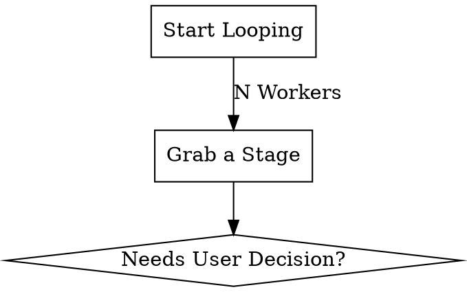

# SVG-to-DOT Parser Design

## Purpose

Convert a Miro-exported SVG diagram (`docs/plans/flow.svg`) into a Graphviz DOT digraph, extracting node text, edge labels, and connection direction.

## Scope

- Standalone TypeScript script at `scripts/svg-to-dot.ts`
- Tuned to this specific Miro SVG export (not general-purpose)
- Outputs DOT language to stdout

## Architecture

### Parsing Strategy: Geometry-based matching

1. **Parse SVG XML** using a DOM parser (`xmldom` or `fast-xml-parser`)
2. **Extract nodes** by identifying `<g>` groups containing shape elements:
   - Rectangles: `<rect class="shape-element shape-element-rect">`
   - Diamonds: `<path>` with diamond geometry (decision nodes)
   - Container nodes: `<rect>` with `fill: #ffffff` and header divider paths
3. **Extract node text** from companion `<g>` groups at the same `translate(x, y)` position
4. **Extract edges** by finding `<g>` groups containing `<use xlink:href="#LineHeadArrow2">`
5. **Extract edge labels** from adjacent `<g>` groups containing text near the edge
6. **Match edges to nodes** using nearest-node-center matching on edge start/end points

### Node Identification

Nodes are pairs of `<g>` elements sharing the same `translate(x, y)`:
- First `<g>`: shape/background layer (contains rect, path, or svg with clipPath)
- Second `<g>`: text layer (contains `<text>` elements)

Node center = `(translate_x + width/2, translate_y + height/2)`

### Edge Identification

Edges are `<g>` elements containing:
- A `<path>` with `stroke="#333333"` and `fill="transparent"`
- A `<use xlink:href="#LineHeadArrow2">` for the arrow head

Edge global start point = transform translate + first point in path `d` attribute
Edge global end point = transform translate + arrow head `translate(ax, ay)` position

The arrow head points to the target node, so:
- **Source node** = nearest node to edge start point
- **Target node** = nearest node to edge end point (arrow head)

### Edge Label Extraction

Edge labels appear as `<g>` elements containing `<text>` that are:
- Positioned near/within the edge's bounding area
- Not associated with any node (don't share a node's translate position)

### Output Format



## Algorithm

```
1. Parse SVG into DOM
2. Collect all top-level <g> children
3. For each <g>:
   a. If contains shape elements (rect.shape-element, diamond path, container rect) → candidate node shape
   b. If contains <use xlink:href="#LineHeadArrow2"> → edge
4. For candidate node shapes, find matching text <g> at same translate position
5. Build node list with: id, label (concatenated text), center point, shape type
6. For each edge:
   a. Parse transform to get global offset
   b. Parse path d-attribute to get local start point
   c. Parse <use> transform to get local arrow end point
   d. Compute global start = offset + local start
   e. Compute global end = offset + local arrow end
   f. Find nearest node to global start → source
   g. Find nearest node to global end → target
7. Collect orphan text <g> elements near edges as labels
8. Output DOT format
```

## Dependencies

- `xmldom` or Node.js built-in DOM parsing (via `jsdom` or similar)
- No other external dependencies needed

## Running

```bash
npx tsx scripts/svg-to-dot.ts docs/plans/flow.svg > output.dot
```
